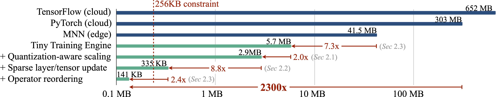
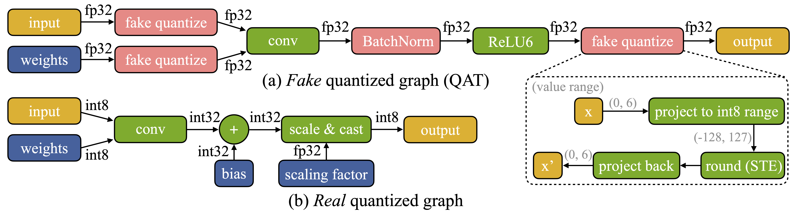
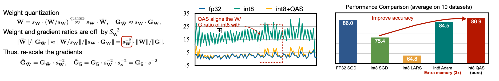
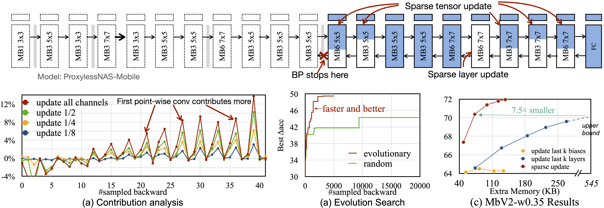
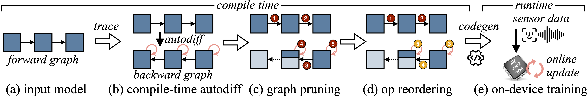
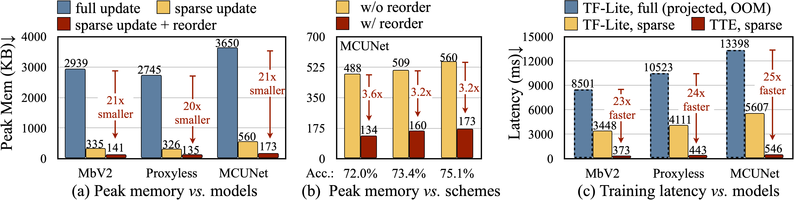

# On-Device Training Under 256KB Memory 

###  [[arXiv]](https://arxiv.org/abs/2206.15472) [[Website]](https://tinytraining.mit.edu/) [[YouTube]](https://www.youtube.com/watch?v=XaDCO8YtmBw) [[BiliBili]](https://www.bilibili.com/video/BV1qv4y1d7MV)


# News
If you are interested in getting updates, please sign up [here](https://forms.gle/UW1uUmnfk1k6UJPPA) to get notified.

* [11/28/2022] Our poster session is on Wed Nov 30 11:30am-1:00pm (New Orleans time)@ Hall J #702. Stop by if you are interested!
* [10/04/2022] Our paper on tiny on-device training is highlighted on the [MIT homepage](http://web.mit.edu/spotlight/learning-edge/)!
* [09/16/2022] Our paper is accepted to NeurIPS 2022!
* [06/30/2022] Our [video demo](https://www.youtube.com/watch?v=XaDCO8YtmBw) of on-device training on micro-controllers is now available online!
* [06/30/2022] Our [paper](https://arxiv.org/abs/2206.15472) is released on arXiv.

# Overview

In the past, DNNs training happens on the cloud. Can we learn on the edge? The large memory usage is the challenge. The tight memory budget (50,000x smaller than GPUs) makes deep learning deployment difficult even for inference, let alone training.


In this work, we enable on-device training under 256KB memory, using less than 1/1000 memory of PyTorch while matching the accuracy on the visual wake words application using **system-algorithm co-design**. 



Our work contains three parts to achieve efficient on-device training: 
1. Quantization-aware scaling and sparse update (algorithm)
2. Compile-time autodiff and system support for sparse update (system)
3. Codegen with TinyEngine backend (system)

If you are interested in the full-stack optimization of the system, you can go over each step one by one. If you are only interested in building a tiny training demo, you may directly refer to the [Tiny Training Engine](https://github.com/mit-han-lab/tinyengine/tree/dev/training_code_gen/tutorial/training) for the demo setup.

## 1. Quantization-aware Scaling (QAS) and Sparse Update

In order to optimize a real quantized graph (see difference below),  we propose Quantization-aware Scaling (QAS) to automatically scale the gradient, which effectively stabilizes the training and matches the FP32 accuracy 

<p align="center">
    
</p>



We further design sparse layer and sparse tensor update to skip the gradient computation of less important layers and sub-tensors, where the best sparsity under varying memory budgets  is find an automated method based on the contribution analysis.



We provides scripts to evaluate the accuracy of QAS and Sparse Update in the [algorithm](algorithm/) folder, and we will use the pretrained models and sparse update scheme for our next step compilation.

## 2. Compile-time Autodiff and System Support for Sparse Update

Another highlight of our work is Tiny Training Engine (TTE), which offloads auto-diff from run-time to compile-time and uses codegen to minimize run-time overhead. It also supports graph pruning and reordering to support sparse updates, translating the theoretical numbers into measured memory saving and speedup.



The code related to compilation, autodiff, and system support for sparse update are provided in the [compilation](compilation/) folder. It will translate the pytorch models into an intermediate representation (IR), perform the autodiff at compile-time, and the apply the sparse update rules to reduce memory usage. Finally, the pruned training graph will be translated into a JSON file to ease MCU deployment.

## 3. Codegen with TinyEngine Backend

After obtaining the JSON representation of training graphs, the next step is to follow the [tiny-engine training tutorial](https://github.com/mit-han-lab/tinyengine/tree/dev/training_code_gen/tutorial/training) to deploy the model to the MCU to compile the demo shown at the beginning. Our optimized kernels and co-designs not only enable training under 256KB but also achieve faster speed than conventional implementations such as TF-Lite.



## Citation

```
 @inproceedings{lin2022ondevice,
    title     = {On-Device Training Under 256KB Memory},
    author    = {Lin, Ji and Zhu, Ligeng and Chen, Wei-Ming and Wang, Wei-Chen and Gan, Chuang and Han, Song},
    booktitle = {Annual Conference on Neural Information Processing Systems (NeurIPS)},
    year      = {2022}
} 
```

## Related Work

* [MCUNet: Tiny Deep Learning on IoT Devices](https://mcunet.mit.edu/#mcunetv1) (NeurIPS'20)
* [MCUNetV2: Memory-Efficient Patch-based Inference for Tiny Deep Learning](https://mcunet.mit.edu/#mcunetv2) (NeurIPS'21)
* [TinyTL: Reduce Activations, Not Trainable Parameters for Efficient On-Device Learning](https://tinytl.mit.edu/) (NeurIPS'20)
* [Network Augmentation for Tiny Deep Learning](https://github.com/mit-han-lab/tinyml/raw/master/netaug/figures/fig3.png) (ICLR'22)


## License

This repository is released under the MIT license. See [LICENSE](LICENSE) for additional details.
